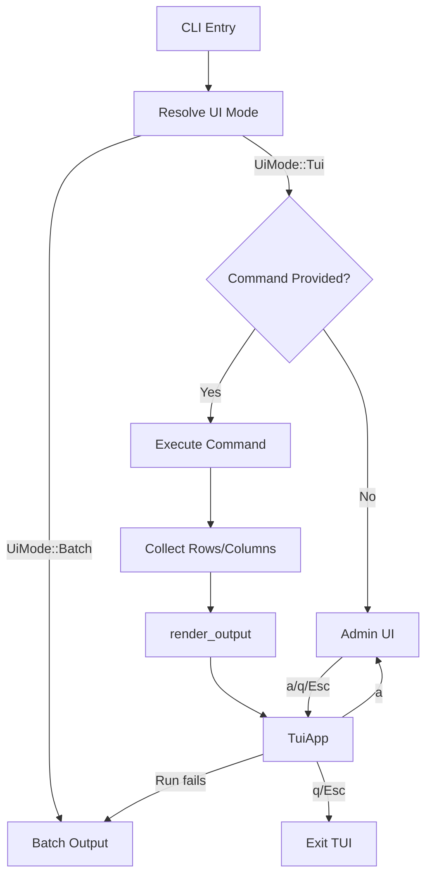
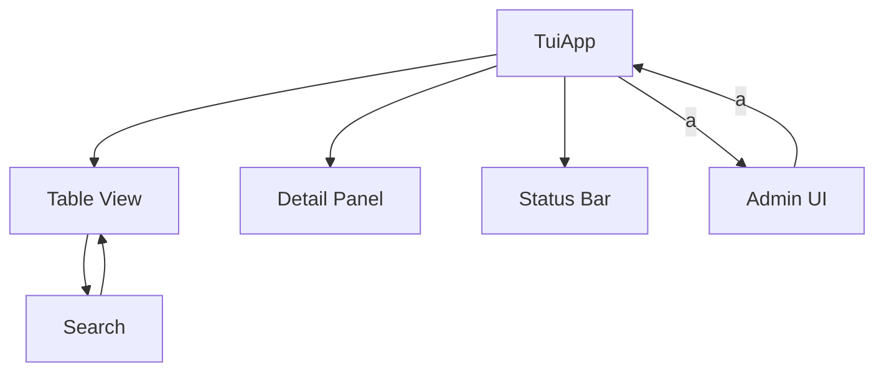
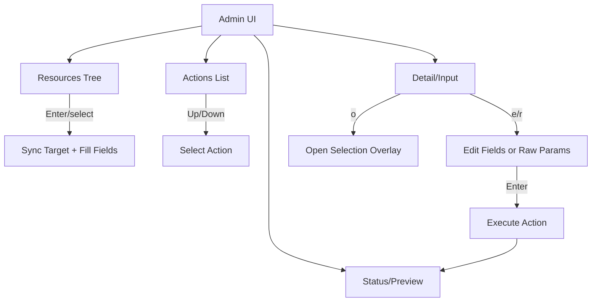

# TUI UI Flowchart and Keybind Summary (v0.4.2)

This document summarizes the TUI flow (results and admin) and keybindings.

## CLI -> UI Mode Flow

## Results TUI Flow

## Admin TUI Flow

## Keybinds (Results TUI)

| Key | Action |
| --- | --- |
| q / Esc | Quit |
| ? | Toggle help |
| / | Search mode |
| n / N | Next/Prev match |
| h j k l | Move selection / scroll columns |
| g / G | Jump top/bottom |
| Ctrl+d / Ctrl+u | Page down/up |
| Enter | Toggle detail panel |
| J / K | Scroll detail panel |
| a | Admin console (when available) |

## Keybinds (Admin TUI)

| Area | Key | Action |
| --- | --- | --- |
| Global | q / Esc / a | Exit admin |
| Global | ? | Toggle help |
| Global | h / l | Focus left/right |
| Resources | j / k | Move selection |
| Resources | g / G | Jump top/bottom |
| Resources | Ctrl+d / Ctrl+u | Page down/up |
| Resources | / | Search |
| Resources | Enter | Apply selection |
| Resources | R | Reload |
| Detail/Input | Up / Down | Move action selection |
| Detail/Input | Tab / Shift+Tab | Move active field |
| Detail/Input | e | Edit active field |
| Detail/Input | r | Toggle raw params |
| Detail/Input | o | Open list for active field |
| Detail/Input | Enter | Execute action |
| Status/Preview | j / k | Scroll |
| Status/Preview | g / G | Jump top/bottom |
| Status/Preview | Ctrl+d / Ctrl+u | Page down/up |
